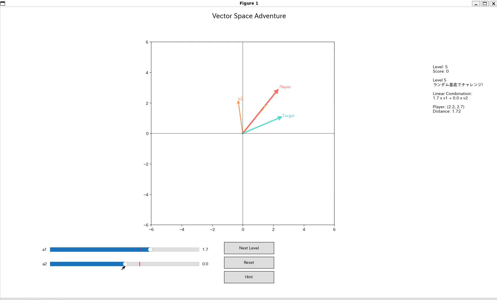

# Vector Space Adventure

**Vector Space Adventure(仮称)**は線形代数におけるベクトル操作を可視化・体験できるインタラクティブ教育ゲームです。
基底ベクトルを線形結合してターゲットベクトルにたどり着きましょう。

---

## デモ


---

## 特徴
- 標準基底からカスタム基底までの体験型学習
- スライダーで係数を調整してプレイヤーベクトルを動かす
- 成功するとスコアが加算
- ベクトルの線形結合と視覚的な平行四辺形の表示
- リアルタイムにヒントがでる機能

### 依存ライブラリ
```bash
pip install numpy matplotlib japanize-matplotlib
